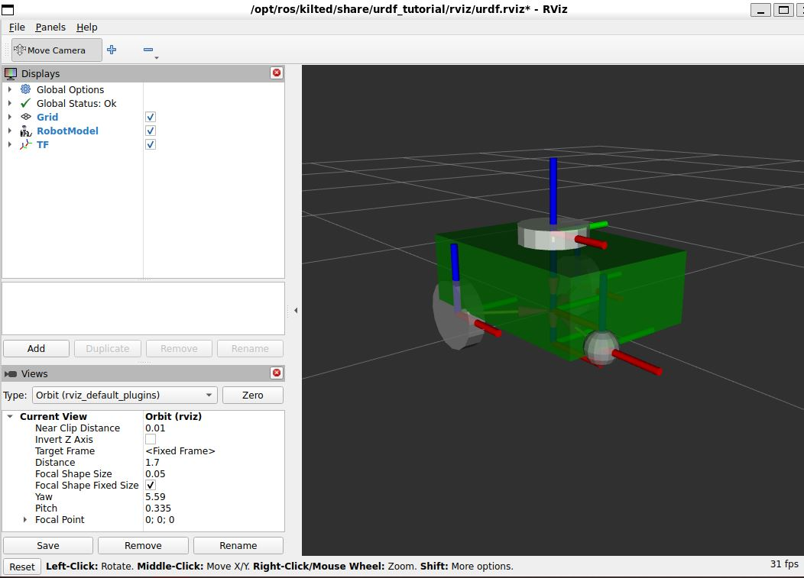
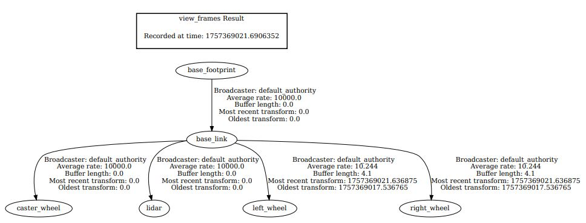

# ROS2 robot

Made through ROS2 kilted version and URDF file

## RViz snipet



## Frames of transfer function



## use humble for ubuntu 22.04
```
source /opt/ros/humble/setup.bash
```
after installing ros-humble-urdf-tutorial

## running ros2 example file:my_robot.urdf
```
ros2 launch urdf_tutorial display.launch.py model:=my_robot.urdf
```
## running the ros2 gazebo command for building_robot.sdf
```
ros2 launch ros_gz_sim gz_sim.launch.py gz_args:="building_robot.sdf"

```


## Setup your environment by sourcing
example using ros2 jazzy
```
. ~/ros2_jazzy/install/local_setup.bash
```
